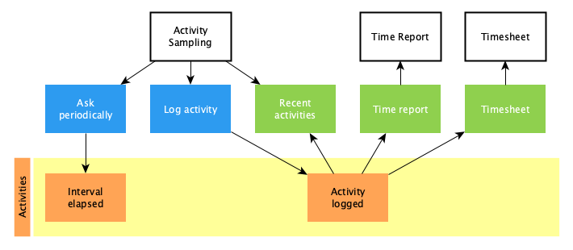

# Activity Sampling

Periodically asks the user about their current activity and logs it for
analysis.

## Domain

### Log Activity

-   Logs the activity with client, project, task and optional notes.
-   Selects an activity from recent activities.
-   Asks periodically what I am working on.
-   Starts countdown with the default interval when the application starts.

### Recent Activities

-   Groups activities by working days for the last 30 days.
-   Summarizes houres worked today, yesterday, this week and this month.
-   Assumes last activity as current activity.

### Hours worked

-   Summarizes hours worked for clients.
-   Summarizes hours worked on projects.
-   Summarizes hours worked on tasks.
-   Summarizes hours worked per day.
-   Summarizes hours worked per week.
-   Summarizes hours worked per month.
-   Summarizes hours worked per year.
-   Summarizes the total hours worked.

### Timesheet

-   Summarizes hours worked on projects per day.
-   Summarizes hours worked on projects per week.
-   Summarizes hours worked on projects per month.
-   Comparse with capacity.
-   Takes holidays into account.
-   Takes vacation into account.

## Events

## Architecture

